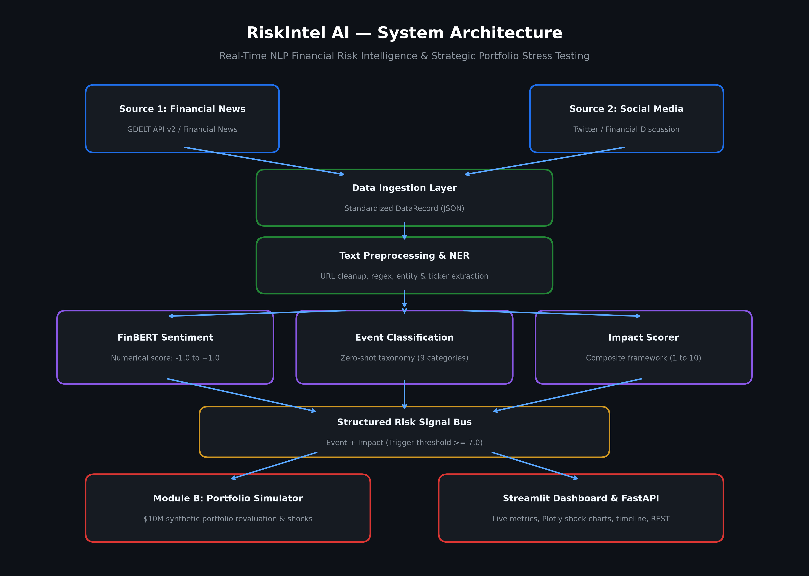

# RiskIntel AI — S&P Global & Crisil Campus Hackathon

**Candidate Name:** Aditya Saurav  
**College Email ID:** [btech60105.23@bitmesra.ac.in]  
**College / Campus:** [Birla Institute of Technology Mesra]  
**Demo Video Link:** [https://youtu.be/zGHaMuyweM0]  
**Slide Deck Link (if hosted externally):** [Slide Deck Link / See docs/presentation.pdf](docs/presentation.pdf)  

---

## 1. Project Overview / Problem Statement & Approach

Modern financial institutions face an avalanche of unstructured data—from fast-moving news wires to volatile social media discourse. Critical market, credit, and geopolitical risks often manifest in unstructured text hours before appearing in balance sheets or quarterly filings. Traditional risk monitoring frameworks rely heavily on backward-looking financial ratios or manual review, leading to delayed risk mitigation and severe portfolio drawdowns.

**RiskIntel AI** is an enterprise-grade AI/NLP risk intelligence platform designed to ingest unstructured financial text from multiple real-world feeds (Global News via GDELT API v2 and Social Media discussions via Financial Tweets) and convert them in real time into standardized, machine-readable risk signals. The engine measures granular sentiment, categorizes events into a 9-class financial taxonomy, and evaluates a multi-factor impact score (1–10).

To make these signals immediately actionable for portfolio managers, the system connects directly to **Module B: Strategic Portfolio Stress Testing**. When a high-impact threat is detected (e.g., Geopolitical or Macroeconomic shock with Impact $\ge 7.0$), the engine automatically maps the event to a calibrated macro stress scenario, dynamically scales asset shocks, and executes revaluation across a \$10.0M multi-asset synthetic portfolio (Loans, Corporate Bonds, Government Bonds, Equities, Derivatives) through an interactive executive dashboard and REST API.

---

## 2. Architecture & Tech Stack

### System Architecture
The platform operates as an end-to-end modular pipeline transforming raw unstructured text into quantified portfolio losses:




### Key Frameworks, Databases & AI/ML Libraries
- **Language & Runtime:** Python 3.10+ / 3.11 / 3.12 / 3.13 (macOS, Linux, Windows compatible)
- **Financial NLP & Sentiment:** `ProsusAI/FinBERT` (Hugging Face Transformers / PyTorch) with deterministic rule-based financial fallbacks
- **Event Classification:** Zero-Shot NLI (`facebook/bart-large-mnli`) mapping headlines into 9 financial taxonomies
- **Impact Scoring:** Multi-factor transparent scoring model combining Severity ($35\%$), Sentiment Magnitude ($20\%$), Entity Importance ($25\%$), and Keyword Urgency ($20\%$)
- **Stress Test Engine:** Custom multi-asset portfolio simulator with dynamic shock scaling and asset-level revaluations
- **Web Dashboard:** Streamlit with custom CSS and Plotly dark-theme interactive shock charts
- **REST API:** FastAPI, Uvicorn, and Pydantic with automated OpenAPI Swagger UI (`/docs`)
- **Data & Testing:** Pandas, NumPy, Python standard `unittest` (12/12 automated unit tests passing)

---

## 3. Dataset Used

The platform demonstrates compliance with multi-source ingestion requirements by processing two distinct real-world data streams into a unified `DataRecord` schema:

1. **Source 1: Global Financial News (GDELT API v2)**
   - *Nature:* Real-time, global event coverage tracking international trade disputes, interest rate hikes, regulatory probes, and central bank actions.
   - *Sample Data:* Pre-packaged in `data/sample/sample_news.json` for offline reliability, with live API fetching via `gdeltdoc`.
2. **Source 2: Financial Social Media Discussions (Twitter / Financial Tweets)**
   - *Nature:* Social sentiment dataset derived from financial Twitter discussions (`zeroshot/twitter-financial-news-sentiment`), capturing retail reactions and breaking sentiment shifts.
   - *Sample Data:* Stored in `data/sample/sample_social.json`.
3. **Synthetic $10.0M Multi-Asset Portfolio**
   - *Location:* `data/portfolio/synthetic_portfolio.json`
   - *Structure:* 6 assets across Corporate Loans (\$3.5M), Government Bonds (\$2.0M), Corporate Bonds (\$1.5M), Equities (\$2.0M), and Financial Derivatives (\$1.0M).

### Key Assumptions:
- Text is ingested in English or standard translated news format.
- Impact score $\ge 7.0$ indicates a severe market anomaly justifying strategic portfolio stress testing.
- Flight-to-safety dynamics are modeled where safe-haven assets (Government Bonds) see positive valuation gains during geopolitical flight while risk-on assets (Equities, High-Yield Corporate Debt, Derivatives) suffer drawdowns.

---

## 4. Quickstart & Installation

**Runtime:** Python 3.10 / 3.11 / 3.12 / 3.13 tested on macOS (Apple Silicon / Intel) and Linux.

### Step-by-Step Setup Commands:

```bash
# 1. Clone repository
git clone https://github.com/adityasaurav/RiskIntel_AI.git
cd RiskIntel_AI

# 2. Install dependencies
pip install -r requirements.txt

# 3. Run automated unit test suite (12/12 passing)
python3 -m unittest discover -s tests -p "test_*.py"

# 4. Run end-to-end CLI live demonstration
python3 run_demo.py

# 5. Launch interactive executive Streamlit dashboard
streamlit run dashboard/app.py
```
*Access Streamlit dashboard in browser:* `http://localhost:8501`

```bash
# 6. (Optional) Start FastAPI REST service
uvicorn api.main:app --reload --port 8000
```
*Access interactive Swagger API docs:* `http://localhost:8000/docs`

---

## 5. Live Demonstration Results (Example Walkthrough)

### Input Headline
> *"US announces new tariffs on Chinese imports, raising concerns about global trade disruption and potential retaliatory measures."*

### Generated Structured Risk Signal (`RiskSignal` JSON)
```json
{
  "timestamp": "2026-10-08T16:54:52+00:00",
  "source": "news",
  "entity": "US",
  "sentiment_score": -0.85,
  "sentiment_label": "negative",
  "event_type": "Geopolitical",
  "event_confidence": 0.85,
  "impact_score": 7.9,
  "risk_level": "HIGH",
  "impact_components": {
    "event_severity": 9.0,
    "sentiment_magnitude": 8.5,
    "entity_importance": 9.0,
    "keyword_urgency": 7.0
  }
}
```

### Module B Portfolio Stress Test Revaluation
```text
=== STRESS TEST RESULT ===
Event Type: Geopolitical
Impact Score: 7.9 / 10
Risk Level: HIGH
Scenario: Geopolitical Stress Scenario (Scale Factor: 0.79x)

Portfolio Before: $10,000,000.00
Portfolio After:  $9,545,750.00
Total Loss:       $454,250.00 (-4.54%)

Asset Impacts:
  Corporate Loan A (Loan):       $2,000,000 → $1,921,000 (-3.95%)
  Corporate Loan B (Loan):       $1,500,000 → $1,440,750 (-3.95%)
  Government Bond (Bond):        $2,000,000 → $2,031,600 (+1.58% Safe-Haven Flow)
  Corporate Bond (Bond):         $1,500,000 → $1,405,200 (-6.32%)
  Equity Portfolio (Equity):     $2,000,000 → $1,842,000 (-7.90%)
  Derivative A (Derivative):     $1,000,000 → $905,200   (-9.48%)
```

---

## 6. Deliverables in `docs/`

- **Executive Presentation Deck:** [`docs/presentation.pdf`](docs/presentation.pdf) (7-slide presentation deck in 16:9 widescreen format adhering to hackathon outline):
  - **Slide 1: Title** - Project Title, Candidate Name, College / Campus, Module B Track
  - **Slide 2: Problem & Approach** - Business problem in own words, automated solution approach
  - **Slide 3: System Design** - 6-stage architecture data flow from raw text to $10M revaluation
  - **Slide 4: Implementation Highlights** - Key modules, FinBERT + BART tech choices, and rationale
  - **Slide 5: Key Results** - Live case study, $10M portfolio shock, and efficiency gains vs. naive approach
  - **Slide 6: Domain Impact** - Institutional value, Basel/Dodd-Frank compliance, target personas
  - **Slide 7: Limitations & Next Steps** - Assumptions, scope boundaries, enterprise roadmap
- **Slide Previews:** High-resolution slide images available in [`docs/slides/`](docs/slides/)
- **Component System Diagram:** [`docs/architecture.png`](docs/architecture.png) (300 DPI high-resolution visual system flow)

---

## 7. License

Distributed under the **MIT License**. See [`LICENSE`](LICENSE) for details.
